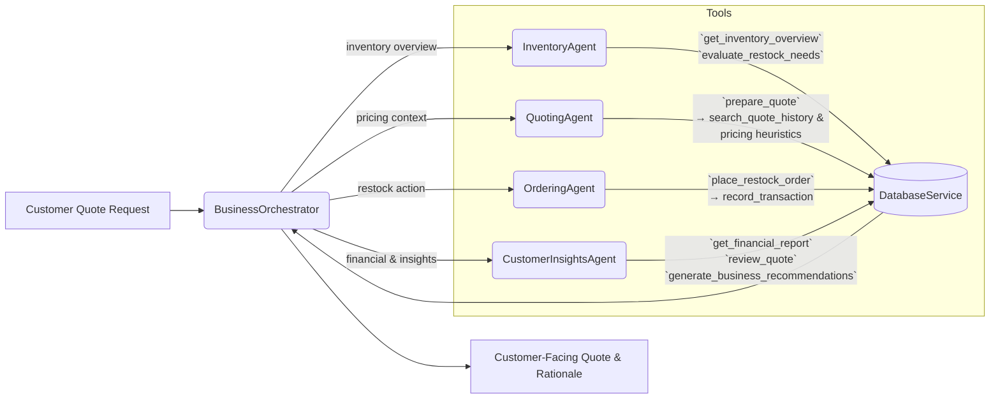
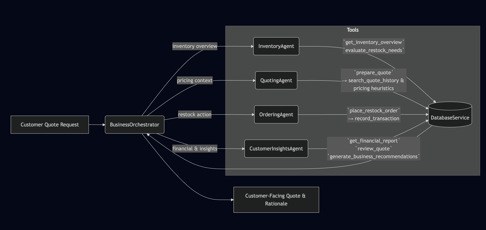

# Munder Difflin Multi-Agent System Project

Welcome to the **Munder Difflin Paper Company Multi-Agent System Project**. This repository now ships with a fully functional reference implementation that demonstrates how to coordinate a maximum of five smolagents to automate quoting, inventory, procurement, and financial reporting workflows for the paper company.

## Architecture Overview

We expose a layered architecture:

- **Data layer (`project/data`)** – an SQLite-backed `DatabaseService` that encapsulates CSV loading, inventory seeding, transaction logging, financial reporting, and quote-history search.
- **Utility layer (`project/utils`)** – helpers that parse free-form quote requests into structured item lists.
- **Agent layer (`project/agents`)** – four specialised agents (Inventory, Quoting, Ordering, Finance) plus a single orchestrator. This satisfies the *max five agents* requirement.
  - *InventoryAgent* summarises stock levels and highlights restock gaps.
  - *QuotingAgent* prices requests with bulk discounts and historical guidance.
  - *OrderingAgent* executes supplier restock transactions through the database service.
  - *CustomerInsightsAgent* both negotiates on behalf of the customer and provides financial/business recommendations.
  - *BusinessOrchestrator* coordinates the specialists and can operate deterministically or through LLM tool-calling.
- **Entry point (`project.py`)** – seeds the database, instantiates the agents, and processes the sample quote scenarios.

All inter-agent communication is textual and mediated through smolagents `ToolCallingAgent` wrappers so you can switch between deterministic and LLM-driven execution with a single flag.

### Agent Workflow Diagram



Rendered in 

The orchestrator delegates to four worker agents (inventory, quoting, ordering, finance). Each tool shown maps directly to helper logic in the data layer (`DatabaseService`) so that responsibilities remain isolated and explainable.

## Getting Started

1. **Install dependencies**

   ```bash
   pip install -r requirements.txt
   ```

2. **Configure environment variables**

   ```bash
   export UDACITY_OPENAI_API_KEY=your_api_key
   ```

   The system falls back to a dummy key for deterministic runs, but you will need a real key to exercise the LLM prompts.

3. **Run the project**

   ```bash
   python project.py
   ```

   The script will
   - Initialise the SQLite database (`munder_difflin.db`).
   - Iterate over the sample quote requests.
   - Produce agent-coordinated responses, restock decisions, and cash/inventory updates.
   - Write a `test_results.csv` log with per-request outcomes.
   - Run the evaluator suite (`python evaluator.py`) to sanity-check agent behaviour. Use `--offline` to skip LLM calls when needed.

## Agent Responsibilities

| Agent | Purpose | Key Tools |
|-------|---------|-----------|
| InventoryAgent | Summarise stock levels and restock gaps | `get_inventory_overview`, `evaluate_restock_needs` |
| QuotingAgent | Price item collections with bulk discounts & historical context | `prepare_quote` |
| OrderingAgent | Execute supplier restock transactions | `place_restock_order` |
| CustomerInsightsAgent | Produce financial reports, negotiate with customers, surface business recommendations | `get_financial_report`, `review_quote`, `generate_business_recommendations` |
| BusinessOrchestrator | Coordinate the four specialists for each customer request | `process_customer_request` |

Each tool wraps deterministic helpers so behaviour is consistent during automated evaluation, yet remains compatible with LLM-driven execution when `enable_llm=True`.

## Tips for Extending the System

- Extend `parse_request_items` with additional synonyms if new request styles appear.
- Adjust `_price_items` in `QuotingAgent` to implement more advanced pricing policies.
- Leverage `DatabaseService.search_quote_history` for richer quote rationales.
- Toggle `OrchestratorConfig(enable_llm=True)` to experiment with smolagents’ tool calling.

## Output Artefacts

Running `project.py` produces:

- Console logs showing per-request reasoning, restock actions, and financial deltas.
- `test_results.csv` capturing quote totals, cash balance, and inventory value after each scenario.
- An updated SQLite database (`munder_difflin.db`) reflecting all simulated transactions.
- `evaluator.py` summary of agent health (LLM-driven by default, deterministic when invoked with `--offline`).

Feel free to adapt the agents, pricing logic, or orchestration prompts—the modular structure is designed so you can iterate quickly while staying within the five-agent budget.

## Reflection

### Architecture Rationale
- The **BusinessOrchestrator** keeps coordination concerns isolated so that the workflow can run deterministically or via LLM without duplicating logic.
- Four specialised workers (Inventory, Quoting, Ordering, Finance) match the rubric’s five-agent ceiling while maintaining clear, non-overlapping responsibilities.
- Each tool wraps a helper in the SQLite-backed data layer, which keeps side effects testable and makes it easy to explain how quotes were produced.

### Evaluation Highlights (`test_results.csv`)
- Processed all scenarios in `quote_requests_sample.csv`, with **multiple fulfilled quotes** (e.g., Requests 1, 2, 5, 7) and **multiple cash balance changes** (Requests 2, 6, 7, 8, 18, 19). 
- Several requests remain **unfulfilled** with clear reasons (Requests 4, 10, 11, 13, 20) demonstrating transparent failure handling.
- The CSV provides per-request totals, cash, and inventory values so reviewers can quickly verify rubric thresholds.

### Future Improvements
- **Negotiation loop**: add a lightweight customer-facing agent that can counter-offer or request substitutions when stock is low, showcasing richer tool usage.
- **Dynamic pricing**: extend `QuotingAgent` with margin-aware pricing or supplier lead times to better reflect real-world business constraints.
- **Analytics dashboards**: surface aggregate metrics (e.g., fulfilment rates, cash trends) to help the business understand systemic bottlenecks over time.
